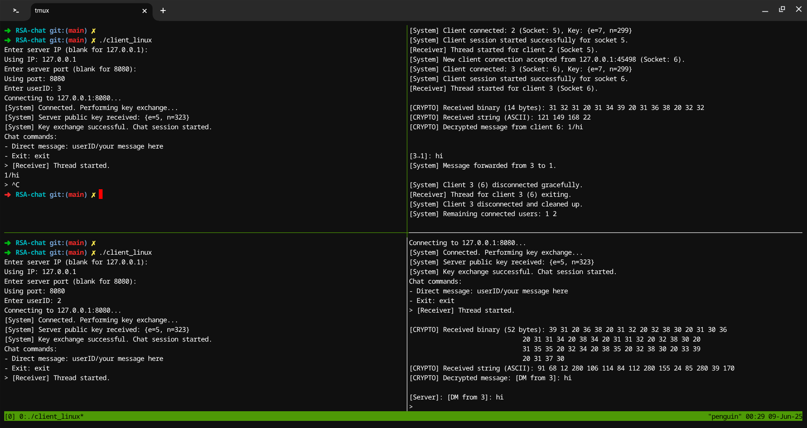

Compile the server:

```
g++ -std=c++11 server_linux.cpp -o server_linux -lpthread
```

Compile the client:

```
g++ -std=c++11 client_linux.cpp -o client_linux -lpthread
```

Run the server:

```
./server_linux
```

It will ask for a port number.

In another terminal, run one or more clients:

```
./client_linux
```

communicate using (user_id)/(message)

# Usage


