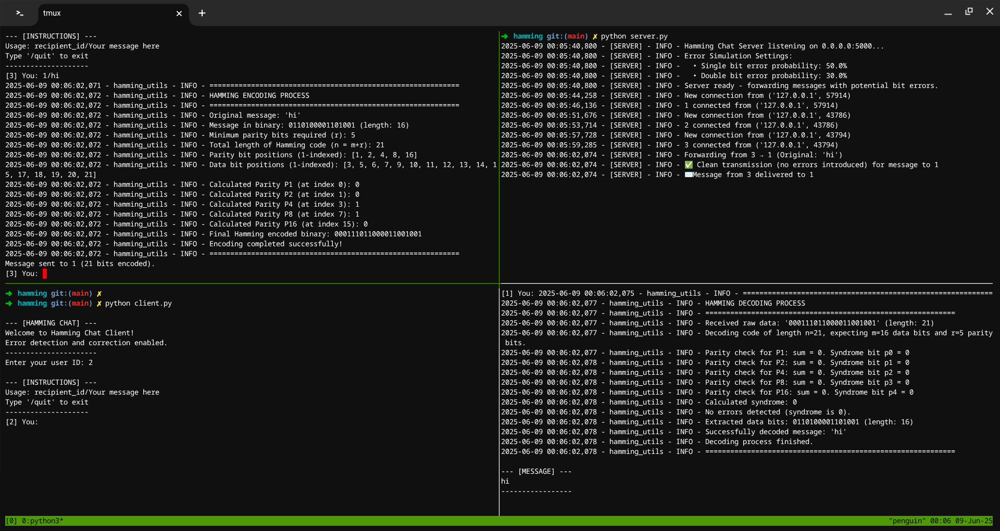

Implement Hamming encoding and decoding, and integrate it into your TCP-based chat app. The server should flip a single bit during transmission, and the receiving client should use Hamming decoding to correct it.

